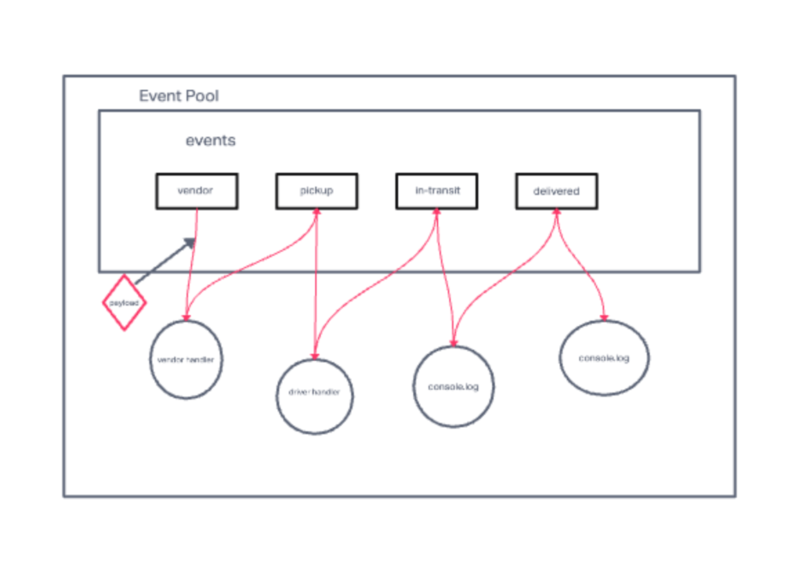

# caps
Author: Adrienne frey

# Description

Lab 11:
 In this first phase, our goal is to setup a pool of events and handler functions, with the intent being to refactor parts of the system throughout the week, but keep the handlers themselves largely the same. The task of “delivering a package” doesn’t change (the handler), even if the mechanism for triggering that task (the event) does.

Lab 12:
The goal of this lab is to create a namespaced Socket.io event server, and to configure Vendor and Driver Client Modules.

The Socket Server will create a namespace of caps that will receive all CAPS event traffic.
Each Vendor and Driver Client will connect to the caps namespace.
The server will emit specific events to each socket that is listening for their designated events from the Global Event Pool defined in the Server.
Each Vendor will only emit and listen for specific events based on their Vendor ID. This will be managed by rooms within Socket.io.
Each Driver will “pick up” a package when the vendor notifies the Server that an “order” is ready and simulate “in-transit” and “delivered” events.

# User Stories

Lab 11:
As a vendor, I want to alert the system when I have a package to be picked up. As a driver, I want to be notified when there is a package to be delivered.
As a driver, I want to alert the system when I have picked up a package and it is in transit. As a driver, I want to alert the system when a package has been delivered.
As a vendor, I want to be notified when my package has been delivered

As a developer, I want to use industry standards for managing the state of each package. As a developer, I want to create an event driven system so that I can write code that happens in response to events, in real time.

Lab 12:
As a vendor, I want to alert the system when I have a package to be picked up. As a driver, I want to be notified when there is a package to be delivered. As a driver, I want to alert the system when I have picked up a package and it is in transit. As a driver, I want to alert the system when a package has been delivered. As a vendor, I want to be notified when my package has been delivered.

As a developer, I want to create network event driven system using Socket.io so that I can write code that responds to events originating from both servers and client applications

# UML

# Collaborators:
John Chavez - code used during code review
Ryan Gallaway
Joe Davitt 
Rafael Aldana
Marco Villifana
